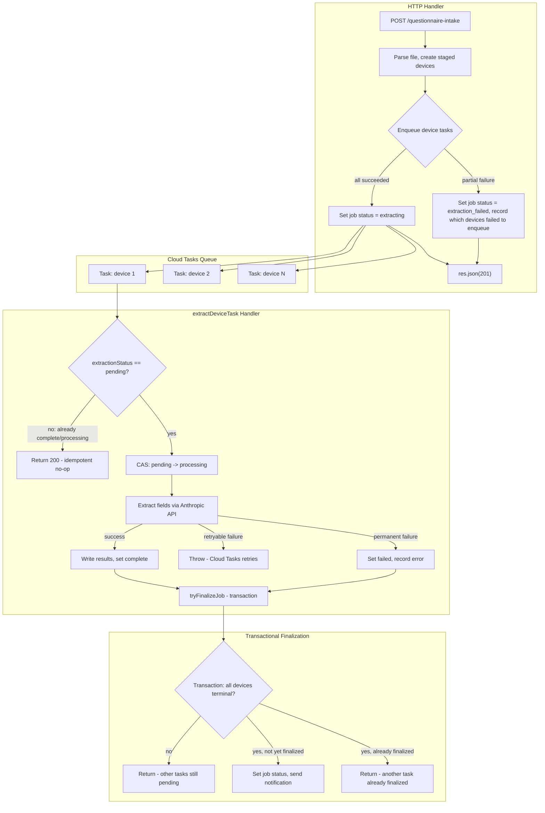

# Task Queue for Questionnaire AI Extraction

## Problem

Extraction runs as a fire-and-forget `Promise` after the HTTP response is sent. Cloud Run considers the request complete and can recycle the instance at any time, silently killing the extraction. Jobs get permanently stuck in `extracting` status with no recovery path.

## Architecture




## Design Decisions

### 1. Idempotency (at-least-once safety)

Cloud Tasks guarantees at-least-once delivery. Duplicate task deliveries must be safe.

Add an `extractionStatus` field to each `questionnaireStagedDevices` doc:


| Value        | Meaning                                                                      |
| ------------ | ---------------------------------------------------------------------------- |
| `pending`    | Not yet picked up by any task                                                |
| `processing` | Task is actively running                                                     |
| `complete`   | Extraction finished successfully                                             |
| `failed`     | Extraction permanently failed (max retries exhausted or non-retryable error) |


The task handler uses compare-and-swap at entry:

```typescript
async function processDeviceExtraction(payload: ExtractionTaskPayload): Promise<void> {
  const db = admin.firestore();
  const deviceRef = db.collection('questionnaireStagedDevices').doc(payload.stagedDeviceId);

  // CAS: only proceed if status is 'pending' (or 'processing' from a prior crashed attempt)
  const acquired = await db.runTransaction(async (tx) => {
    const snap = await tx.get(deviceRef);
    const status = snap.data()?.extractionStatus;
    if (status === 'complete' || status === 'failed') return false;
    tx.update(deviceRef, { extractionStatus: 'processing' });
    return true;
  });

  if (!acquired) {
    log.info('Skipping duplicate task delivery', { ...payload });
    return; // 200 response — tells Cloud Tasks "done, don't retry"
  }

  // ... proceed with extraction
}
```

This ensures:

- A duplicate delivery for an already-complete device is a no-op (returns 200)
- A retry after a crash (status still `processing`) is allowed to re-run
- Field writes are also safe because `batch.set(ref, updates, { merge: true })` is idempotent for the same values

### 2. Transaction-safe finalization

Multiple tasks can finish simultaneously and race on finalization. Use a Firestore transaction with a `finalized` guard:

```typescript
async function tryFinalizeJob(intakeJobId: string): Promise<void> {
  const db = admin.firestore();
  const jobRef = db.collection('questionnaireIntakeJobs').doc(intakeJobId);

  await db.runTransaction(async (tx) => {
    const jobSnap = await tx.get(jobRef);
    const job = jobSnap.data()!;

    // Guard: already finalized by another task
    if (job.status !== 'extracting') return;

    // Count terminal devices
    const devicesSnap = await tx.get(
      db.collection('questionnaireStagedDevices')
        .where('intakeJobId', '==', intakeJobId)
    );

    const total = devicesSnap.size;
    const complete = devicesSnap.docs.filter(
      d => d.data().extractionStatus === 'complete'
    ).length;
    const failed = devicesSnap.docs.filter(
      d => d.data().extractionStatus === 'failed'
    ).length;
    const pending = total - complete - failed;

    if (pending > 0) return; // other tasks still in flight

    const finalStatus = complete === 0 ? 'extraction_failed' : 'pending_review';
    tx.update(jobRef, {
      status: finalStatus,
      devicesComplete: complete,
      devicesFailed: failed,
      aiExtractionCompletedAt: new Date().toISOString(),
      extractionStep: complete > 0 ? 4 : null,
      extractionCurrentDevice: null,
      extractionError: failed > 0
        ? `${failed} of ${total} device(s) failed extraction.`
        : null,
      updatedAt: new Date().toISOString(),
    });
  });

  // Notification OUTSIDE the transaction — safe to send once because
  // only the winner of the transaction will reach this point.
  // Re-read job to check if we were the finalizer.
  const jobSnap = await db.collection('questionnaireIntakeJobs').doc(intakeJobId).get();
  const job = jobSnap.data()!;
  if (job.status === 'pending_review' && !job.notificationSentAt) {
    await sendAdminNotification(intakeJobId, job);
    await jobSnap.ref.update({ notificationSentAt: new Date().toISOString() });
  }
}
```

The `notificationSentAt` field on the job doc is the dedup guard for notifications. Even if two tasks somehow both exit the transaction (impossible with Firestore serializable transactions, but defense-in-depth), only one will see `notificationSentAt` unset.

### 3. Safe fan-out (partial enqueue handling)

Don't set job status to `extracting` until all tasks are confirmed enqueued:

```typescript
const queue = getFunctions().taskQueue(
  `locations/us-central1/functions/extractDeviceTask`
);
const enqueueResults: { deviceId: string; success: boolean; error?: string }[] = [];

for (const device of stagedDevices) {
  try {
    await queue.enqueue(
      { intakeJobId: jobId, stagedDeviceId: device.id },
      { dispatchDeadlineSeconds: 1800 },
    );
    enqueueResults.push({ deviceId: device.id, success: true });
  } catch (err) {
    enqueueResults.push({
      deviceId: device.id,
      success: false,
      error: err instanceof Error ? err.message : String(err),
    });
    // Mark the device as failed so it doesn't block finalization
    await db.collection('questionnaireStagedDevices').doc(device.id).update({
      extractionStatus: 'failed',
      extractionError: `Failed to enqueue extraction task: ${err instanceof Error ? err.message : String(err)}`,
    });
  }
}

const allEnqueued = enqueueResults.every(r => r.success);
const noneEnqueued = enqueueResults.every(r => !r.success);

await jobRef.update({
  status: noneEnqueued ? 'extraction_failed' : 'extracting',
  extractionError: noneEnqueued
    ? 'Failed to enqueue any extraction tasks'
    : !allEnqueued
      ? `${enqueueResults.filter(r => !r.success).length} device(s) failed to enqueue`
      : null,
  tasksEnqueued: enqueueResults.filter(r => r.success).length,
  updatedAt: new Date().toISOString(),
});
```

### 4. Timeout and retry alignment


| Parameter                       | Value         | Reasoning                                                                                                                                                        |
| ------------------------------- | ------------- | ---------------------------------------------------------------------------------------------------------------------------------------------------------------- |
| `timeoutSeconds`                | 300 (5 min)   | Per-invocation. Covers 4 AI chunks at 45s each + inter-chunk delays + Firestore writes                                                                           |
| `retryConfig.maxAttempts`       | 3             | Total attempts (not retries). 3 chances before permanent failure                                                                                                 |
| `retryConfig.minBackoffSeconds` | 60            | Wait at least 1 min between retries (Anthropic rate limits)                                                                                                      |
| `retryConfig.maxBackoffSeconds` | 300           | Cap backoff at 5 min                                                                                                                                             |
| `dispatchDeadlineSeconds`       | 1800 (30 min) | Total task lifetime including all retries. Must exceed `timeoutSeconds * maxAttempts + sum(backoffs)` = 300*3 + 60 + 120 = 1080s. 1800s gives comfortable margin |


When a task invocation times out (300s), Cloud Tasks sees a non-200 response and retries per the config. The task handler distinguishes retryable vs permanent failures:

- **Retryable** (throw error): API timeouts, rate limits, transient Firestore errors. Cloud Tasks retries.
- **Permanent** (catch and mark failed): Invalid data, missing API key, all AI chunks returned empty. Return 200 so Cloud Tasks doesn't retry.

### 5. Queue region, naming, and IAM

- Queue name is derived from the function name: `extractDeviceTask`
- Enqueue using the full resource path: `locations/us-central1/functions/extractDeviceTask`
- Firebase CLI auto-creates the Cloud Tasks queue on first deploy and configures IAM (grants `cloudtasks.tasks.create` to the default service account and `run.invoker` to the Cloud Tasks service agent)
- Verify post-deploy with: `gcloud tasks queues describe extractDeviceTask --location=us-central1`

### 6. Observability

Structured log events at each lifecycle point, all with `intakeJobId` and `stagedDeviceId`:


| Event                              | Level | When                                            |
| ---------------------------------- | ----- | ----------------------------------------------- |
| `extraction.task.enqueued`         | INFO  | Task successfully enqueued                      |
| `extraction.task.enqueue_failed`   | ERROR | Task failed to enqueue                          |
| `extraction.task.started`          | INFO  | Task handler acquired CAS lock                  |
| `extraction.task.skipped`          | INFO  | Duplicate delivery detected (idempotency guard) |
| `extraction.task.chunk_complete`   | INFO  | One AI chunk finished (keep existing)           |
| `extraction.task.complete`         | INFO  | Device extraction finished                      |
| `extraction.task.failed`           | ERROR | Device extraction permanently failed            |
| `extraction.task.retrying`         | WARN  | Throwing to trigger Cloud Tasks retry           |
| `extraction.job.finalized`         | INFO  | Job reached terminal status                     |
| `extraction.job.notification_sent` | INFO  | Admin notification dispatched                   |


Include `taskAttempt` (from `X-CloudTasks-TaskRetryCount` header, available via `req.headers`) in all task-handler log entries.

**Stale extraction recovery**: Keep the self-healing logic in the GET `/:id` endpoint as a fallback. Even with Cloud Tasks, edge cases exist (queue paused, IAM misconfiguration, task silently dropped after max retries). The recovery catches any device stuck in `processing` for >15 minutes and marks it `failed`, then calls `tryFinalizeJob`. This is the safety net, not the primary mechanism.

## Files Changed


| File                                                                                                 | Change                                                                                                                                  |
| ---------------------------------------------------------------------------------------------------- | --------------------------------------------------------------------------------------------------------------------------------------- |
| [functions/src/index.ts](functions/src/index.ts)                                                     | Export `extractDeviceTask` alongside `api`                                                                                              |
| [functions/src/services/questionnaireExtractor.ts](functions/src/services/questionnaireExtractor.ts) | Add `processDeviceExtraction`, `tryFinalizeJob`. Remove `runExtractionJob`. Simplify `retryDeviceExtraction` to re-enqueue              |
| [functions/src/routes/questionnaireIntake.ts](functions/src/routes/questionnaireIntake.ts)           | Replace 3 fire-and-forget sites with safe fan-out. Update stale recovery to use `extractionStatus`. Add `enqueueExtractionTasks` helper |
| [functions/src/types/index.ts](functions/src/types/index.ts)                                         | Add `ExtractionStatus` type, `ExtractionTaskPayload` interface                                                                          |


## What does NOT change

- `extractDeviceFields`, `extractChunk`, normalization, conflict detection, device matching — all stay the same
- Frontend polling (GET `/:id` already returns `extractionProgress`)
- Frontend pages, components, and API client
- Firestore security rules (tasks use Admin SDK)

